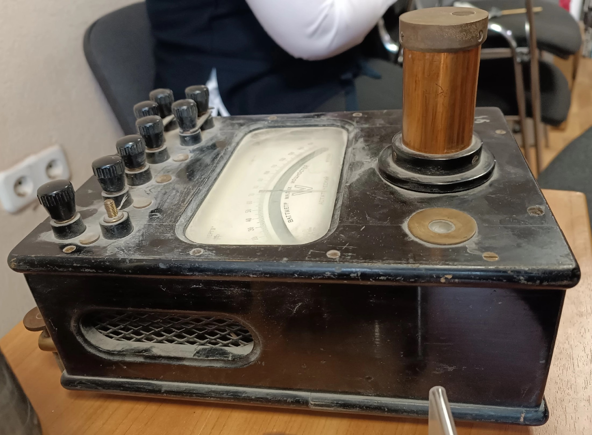
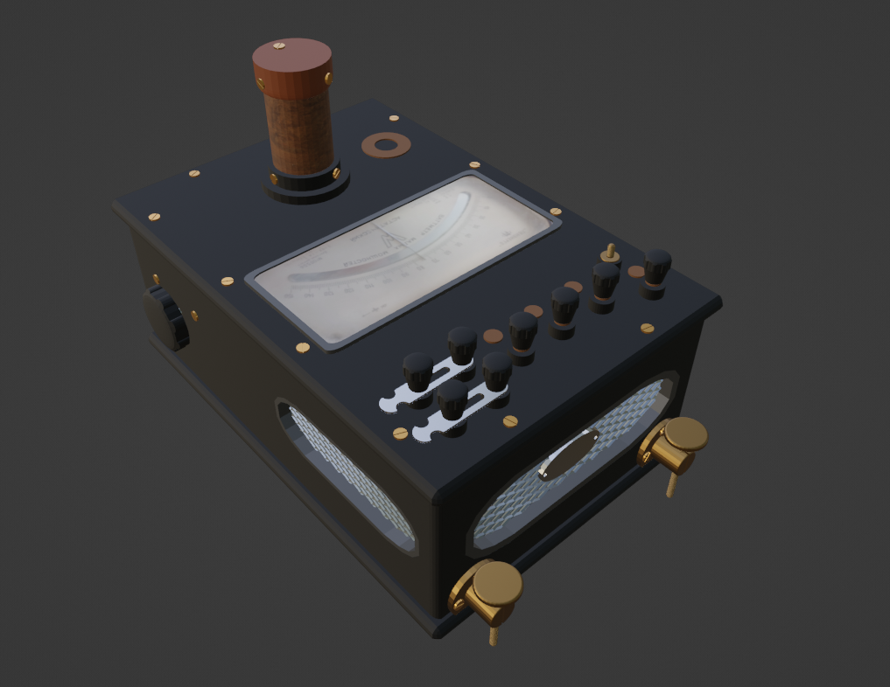
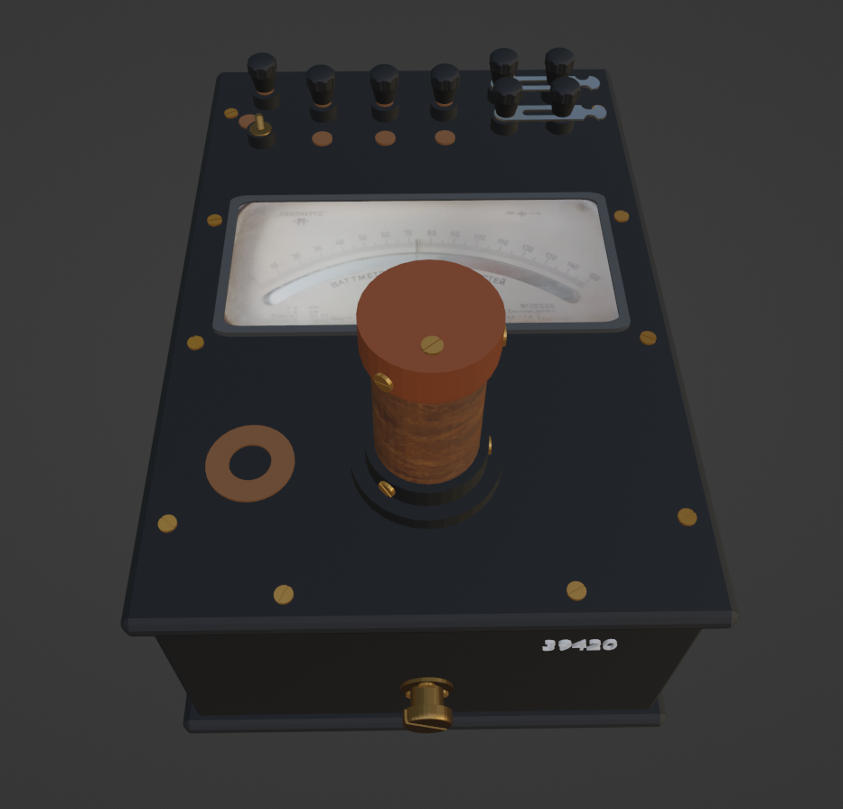
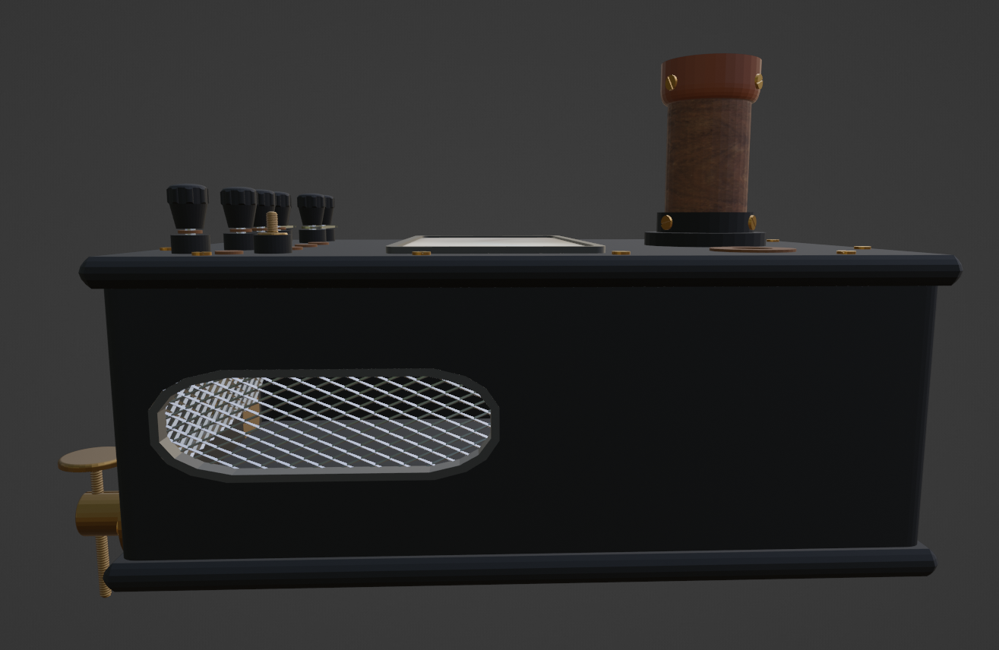
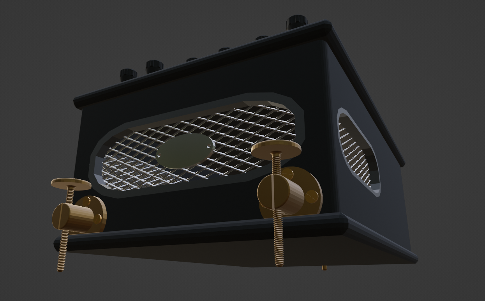
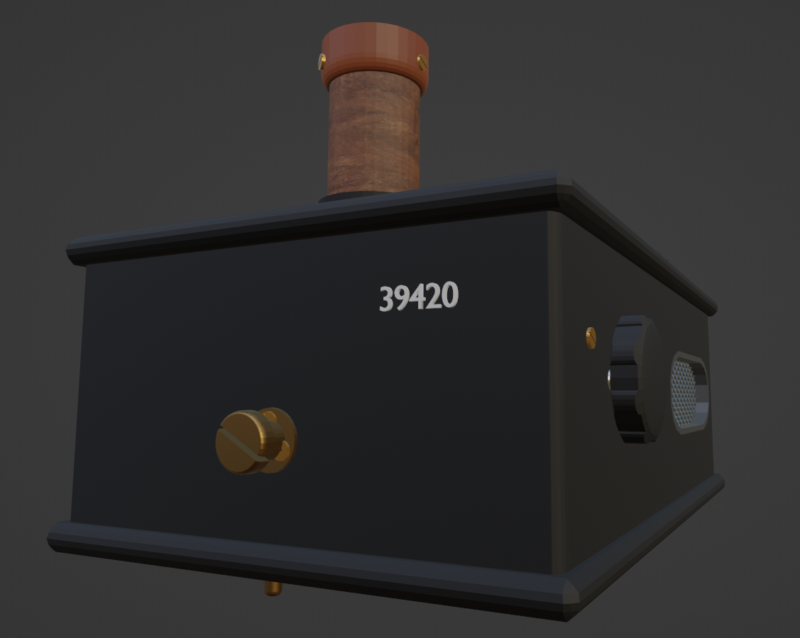
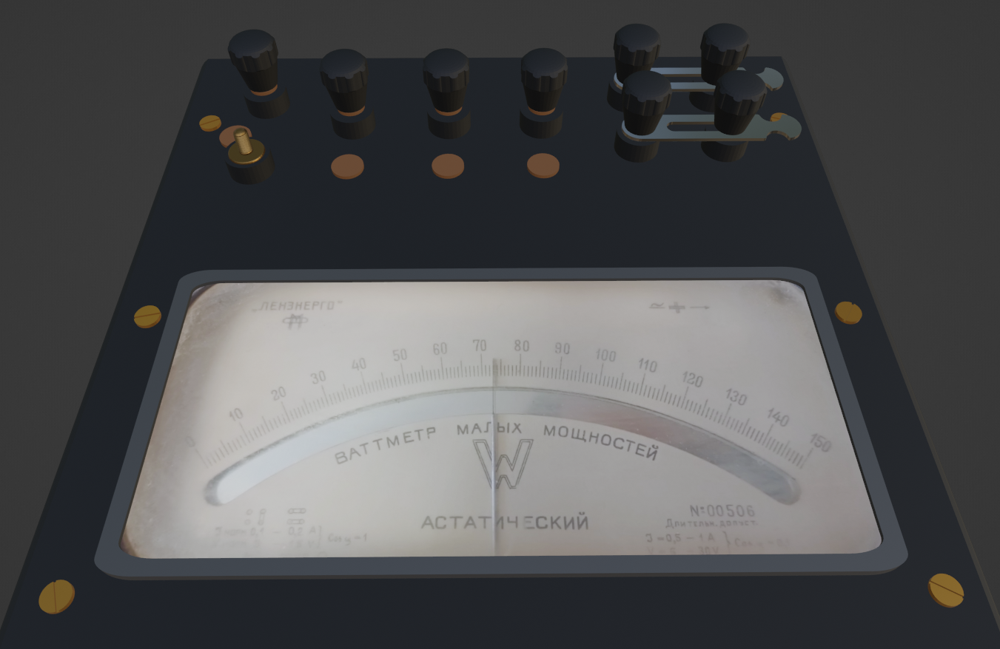
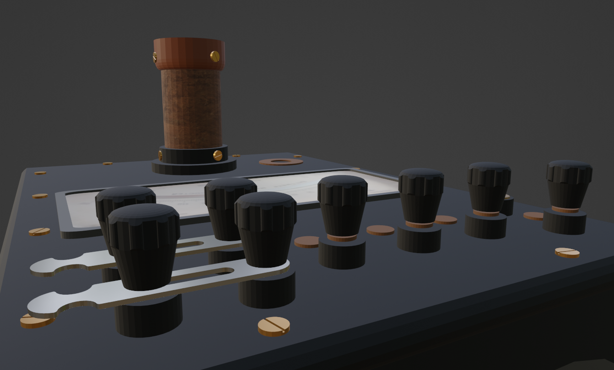

# wattmeter-3d-model

Референс для создания модели был получен от цифрового музея СПбПУ:

В процессе работы были использованы стандартные инструменты для трансформации объектов, различные модификаторы, а также доступные в среде Blender текстуры.
Дизайнерская часть остаётся в доработке для дальнейшего дополнения в соответствии с действительным видом всего объекта и его текстурными деталями.

Получены следующие результаты:

